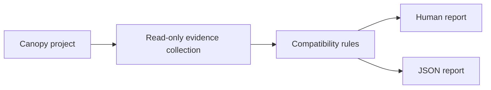
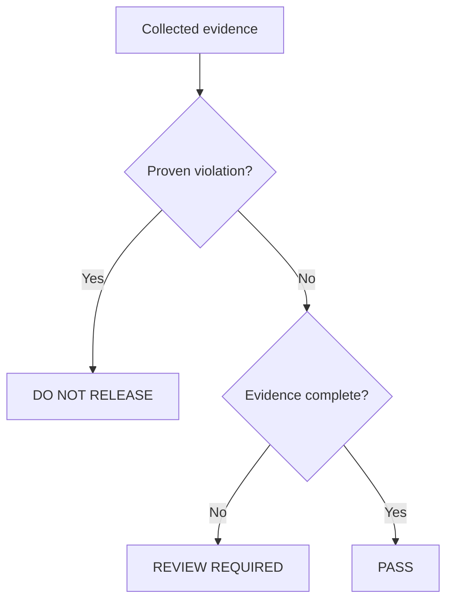

# Canopy Preflight

[](https://github.com/jerrygeorge360/canopy-preflight/actions/workflows/ci.yml)
[](https://github.com/jerrygeorge360/canopy-preflight/releases)
[](https://github.com/marketplace/actions/canopy-doctor)
[](LICENSE)

Canopy Preflight checks Canopy plugins and forks before release. Its command-line
tool, `canopy-doctor`, reads a project without running or modifying it.

Canopy Preflight is an independent open-source project. It is not an official
Canopy Network product.

```bash
canopy-doctor check ./plugin/go
```

## Demo

[Watch the 59-second real-time Canopy Doctor demo](https://github.com/jerrygeorge360/canopy-preflight/releases/download/v0.3.0/canopy-preflight-terminal-demo-v0.3.0.mp4).

Example result:

```text
Canopy Doctor
Target: plugin/go
Decision: PASS
Findings: 0
```

## Checks

| Rule | Checks | Blocking result |
| --- | --- | --- |
| `CNPY001` | Transaction registry and type URLs | Proven count or descriptor mismatch |
| `CNPY002` | Custom state prefixes | A one-byte prefix in Canopy's reserved range `1` to `15` |
| `CNPY003` | Protobuf descriptors and `types.Account.nonce` field `7` | Invalid selected descriptors or an incompatible protected field |
| `CNPY004` | Fork drift and active protocol version | Candidate version below an active requirement |

Unknown or incomplete evidence produces `REVIEW REQUIRED`. The tool blocks only
when it can prove a supported violation.

## How it works



The checker does not execute project binaries, tests, generators, scripts, Git
hooks, or plugin code.

## Install

Download the binary for your operating system and processor from
[GitHub Releases](https://github.com/jerrygeorge360/canopy-preflight/releases/latest).

| System | Processor | File suffix |
| --- | --- | --- |
| Linux | Intel or AMD 64-bit | `linux_amd64` |
| Linux | ARM 64-bit | `linux_arm64` |
| macOS | Intel | `darwin_amd64` |
| macOS | Apple Silicon | `darwin_arm64` |
| Windows | Intel or AMD 64-bit | `windows_amd64.exe` |
| Windows | ARM 64-bit | `windows_arm64.exe` |

Linux example:

```bash
chmod +x canopy-doctor_vX.Y.Z_linux_amd64
sudo install canopy-doctor_vX.Y.Z_linux_amd64 /usr/local/bin/canopy-doctor
canopy-doctor --version
```

Replace `vX.Y.Z` with the downloaded release version.

Verify the downloaded file against `checksums.txt` before installation:

```bash
sha256sum -c checksums.txt --ignore-missing
```

Build from source:

```bash
make build
./bin/canopy-doctor --version
```

## Usage

Check a plugin or fork:

```bash
canopy-doctor check /path/to/project
canopy-doctor check --format json /path/to/project
```

The path defaults to the current directory.

Run fork-drift analysis with immutable commits and deployment context:

```bash
canopy-doctor check \
  --upstream-base <full-commit-sha> \
  --upstream-target <full-commit-sha> \
  --deployment-height <height> \
  --activation-height <height> \
  --required-protocol-version <version> \
  /path/to/clean-canopy-fork
```

The commits must already exist locally. Canopy Doctor does not fetch commits or
query governance state.

## Decisions



| Exit code | Decision | Meaning |
| ---: | --- | --- |
| `0` | `PASS` | No supported violation found |
| `1` | Operational error | Invalid input or inspection failure |
| `2` | `REVIEW REQUIRED` | Evidence is incomplete or ambiguous |
| `3` | `DO NOT RELEASE` | A supported violation was proven |

`PASS` covers only the implemented rules. Continue normal testing, code review,
upgrade rehearsal, and validator coordination.

## GitHub Actions

Copy [`examples/canopy-doctor.yml`](examples/canopy-doctor.yml), or use the
repository Action directly:

```yaml
- name: Check Canopy compatibility
  uses: jerrygeorge360/canopy-preflight@<full-commit-sha>
  with:
    path: .
    format: human
```

Pin the Action to a reviewed full commit SHA. See
[`docs/GITHUB_ACTION.md`](docs/GITHUB_ACTION.md) for all inputs.

## Development

Requirements: Go `1.26` or the version declared in `go.mod`, Git, and Make.

```bash
make check
make build
```

`make check` verifies formatting, runs `go vet`, executes all tests, and runs the
race detector. Test fixtures cover passing, review, blocking, malformed, and
resource-limit cases.

Useful documentation:

- [`docs/DEMO.md`](docs/DEMO.md): runnable examples
- [`docs/ARCHITECTURE.md`](docs/ARCHITECTURE.md): code boundaries and data flow
- [`docs/OUTPUT_CONTRACT.md`](docs/OUTPUT_CONTRACT.md): human and JSON output
- [`docs/rules/`](docs/rules/README.md): rule evidence and limitations
- [`docs/Canopy-Preflight-Overview.pptx`](docs/Canopy-Preflight-Overview.pptx): product overview slides
- [`SECURITY.md`](SECURITY.md): inspection boundary and vulnerability reporting
- [`CONTRIBUTING.md`](CONTRIBUTING.md): contribution requirements

## License

Copyright 2026 jerrygeorge360. Licensed under the
[Apache License 2.0](LICENSE). See [`NOTICE`](NOTICE).
